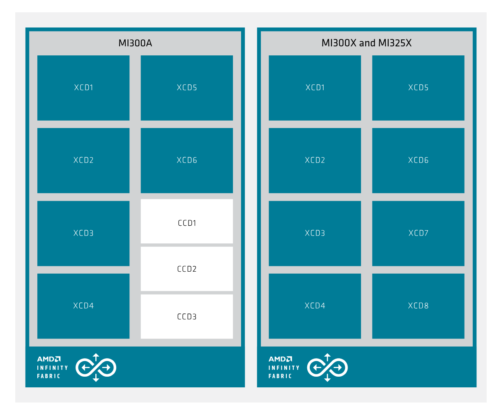

# How to set compute paritions on MI300A/MI300X systems

This page walks through changing compute partitions on MI300A/MI300X systems. Currently, this applies only to the Nicholson cluster. In this example, we'll change Nicholson from using a `CPX` compute parition to a `SPX` compute parition.

## What are compute partitions?
The MI300 architecture is composed of a series of networking and compute chiplets. In MI300, there are two different chiplet categories that are critical in the understanding of the architecture, the XCD (Accelerator Complex Die) and the IOD (I/O Die).

A single MI300A is composed of 6 XCDs and 3 IODs. Each pair of XCDs is 3D-stacked on the top of an IOD, which are then connected using an inter-die interconnect. The MI300A also has 3 CCDs (Core Complex Dies), which can be thought of as the "CPU part" of the APU.

<figure markdown="span">
  { width="600" }
  <figcaption>Figure 1: MI300 block diagrams (from CDNA3 White Paper, Page 4)</figcaption>
</figure>

Compute partitioning modes refer to the logical partitioning of XCDs into devices in the ROCm stack. The names are derived from the number of logical partitions that are created out of the XCDs.

MI300A has three possible compute partition modes:
- SPX (Single Partitioned X-celerator) : all XCDs behave as one GPU (default mode)
- TPX (Triple Partitioned X-celerator) : each pair of XCDs behaves as one GPU
- CPX (Core Partitioned X-celerator) : each individual XCD behaves as one GPU

For a 4x MI300A system, this means

| Compute Parition   | Available GPUs for a single APU | Available GPUs for a 4x APU System |
| --------           | -------                         | -------                            |
| SPX                | 1                               | 4                                  |
| TPX                | 3                               | 12                                 |
| CPX                | 6                               | 24                                 |


Please refer to the CDNA3 White Paper for more detailed information.

## Admin walkthrough
- [Deep dive into the MI300 compute and memory partition modes](https://rocm.blogs.amd.com/software-tools-optimization/compute-memory-modes/README.html)
- [CDNA3 White Paper](https://www.amd.com/content/dam/amd/en/documents/instinct-tech-docs/white-papers/amd-cdna-3-white-paper.pdf)

Head to the Galapagos cluster and log in. In the top left, click on the panel labelled `<user>@port` and select `<admin account>@nicholson` in the dropdown menu. You should be prompted to provide the password for your admin account. Once logged in, select the "Terminal" panel in the bottom left.

A version of ROCm should already be loaded by default. If not, enter `module avail` and `module load` an available ROCm version.

Once ROCm is loaded, we can use `amd-smi` to change the compute partition.

First, check which compute partition is currently active with `amd-smi static --partition`:

<details>
<summary>Output of <code>amd-smi static --partition</code></summary>

```sh
$ amd-smi static --partition
GPU: 0
    PARTITION:
        COMPUTE_PARTITION: CPX
        MEMORY_PARTITION: NPS1
        PARTITION_ID: 0

GPU: 1
    PARTITION:
        COMPUTE_PARTITION: CPX
        MEMORY_PARTITION: NPS1
        PARTITION_ID: 1

GPU: 2
    PARTITION:
        COMPUTE_PARTITION: CPX
        MEMORY_PARTITION: NPS1
        PARTITION_ID: 2

GPU: 3
    PARTITION:
        COMPUTE_PARTITION: CPX
        MEMORY_PARTITION: NPS1
        PARTITION_ID: 3

GPU: 4
    PARTITION:
        COMPUTE_PARTITION: CPX
        MEMORY_PARTITION: NPS1
        PARTITION_ID: 4

GPU: 5
    PARTITION:
        COMPUTE_PARTITION: CPX
        MEMORY_PARTITION: NPS1
        PARTITION_ID: 5

GPU: 6
    PARTITION:
        COMPUTE_PARTITION: CPX
        MEMORY_PARTITION: NPS1
        PARTITION_ID: 0

GPU: 7
    PARTITION:
        COMPUTE_PARTITION: CPX
        MEMORY_PARTITION: NPS1
        PARTITION_ID: 1

GPU: 8
    PARTITION:
        COMPUTE_PARTITION: CPX
        MEMORY_PARTITION: NPS1
        PARTITION_ID: 2

GPU: 9
    PARTITION:
        COMPUTE_PARTITION: CPX
        MEMORY_PARTITION: NPS1
        PARTITION_ID: 3

GPU: 10
    PARTITION:
        COMPUTE_PARTITION: CPX
        MEMORY_PARTITION: NPS1
        PARTITION_ID: 4

GPU: 11
    PARTITION:
        COMPUTE_PARTITION: CPX
        MEMORY_PARTITION: NPS1
        PARTITION_ID: 5

GPU: 12
    PARTITION:
        COMPUTE_PARTITION: CPX
        MEMORY_PARTITION: NPS1
        PARTITION_ID: 0

GPU: 13
    PARTITION:
        COMPUTE_PARTITION: CPX
        MEMORY_PARTITION: NPS1
        PARTITION_ID: 1

GPU: 14
    PARTITION:
        COMPUTE_PARTITION: CPX
        MEMORY_PARTITION: NPS1
        PARTITION_ID: 2

GPU: 15
    PARTITION:
        COMPUTE_PARTITION: CPX
        MEMORY_PARTITION: NPS1
        PARTITION_ID: 3

GPU: 16
    PARTITION:
        COMPUTE_PARTITION: CPX
        MEMORY_PARTITION: NPS1
        PARTITION_ID: 4

GPU: 17
    PARTITION:
        COMPUTE_PARTITION: CPX
        MEMORY_PARTITION: NPS1
        PARTITION_ID: 5

GPU: 18
    PARTITION:
        COMPUTE_PARTITION: CPX
        MEMORY_PARTITION: NPS1
        PARTITION_ID: 0

GPU: 19
    PARTITION:
        COMPUTE_PARTITION: CPX
        MEMORY_PARTITION: NPS1
        PARTITION_ID: 1

GPU: 20
    PARTITION:
        COMPUTE_PARTITION: CPX
        MEMORY_PARTITION: NPS1
        PARTITION_ID: 2

GPU: 21
    PARTITION:
        COMPUTE_PARTITION: CPX
        MEMORY_PARTITION: NPS1
        PARTITION_ID: 3

GPU: 22
    PARTITION:
        COMPUTE_PARTITION: CPX
        MEMORY_PARTITION: NPS1
        PARTITION_ID: 4

GPU: 23
    PARTITION:
        COMPUTE_PARTITION: CPX
        MEMORY_PARTITION: NPS1
        PARTITION_ID: 5
```
</details>

On paper, you can also get partition information from `amd-smi partition`. However, at the time of publication, . Example output for

<details>
<summary>Output of <code>amd-smi partition</code></summary>

```
$ amd-smi partition
CURRENT_PARTITION:
GPU_ID       MEMORY  ACCELERATOR_TYPE  ACCELERATOR_PROFILE_INDEX  PARTITION_ID
0            NPS1    N/A               N/A                        N/A
1            NPS1    N/A               N/A                        N/A
2            NPS1    N/A               N/A                        N/A
3            NPS1    N/A               N/A                        N/A
4            NPS1    N/A               N/A                        N/A
5            NPS1    N/A               N/A                        N/A
6            NPS1    N/A               N/A                        N/A
7            NPS1    N/A               N/A                        N/A
8            NPS1    N/A               N/A                        N/A
9            NPS1    N/A               N/A                        N/A
10           NPS1    N/A               N/A                        N/A
11           NPS1    N/A               N/A                        N/A
12           NPS1    N/A               N/A                        N/A
13           NPS1    N/A               N/A                        N/A
14           NPS1    N/A               N/A                        N/A
15           NPS1    N/A               N/A                        N/A
16           NPS1    N/A               N/A                        N/A
17           NPS1    N/A               N/A                        N/A
18           NPS1    N/A               N/A                        N/A
19           NPS1    N/A               N/A                        N/A
20           NPS1    N/A               N/A                        N/A
21           NPS1    N/A               N/A                        N/A
22           NPS1    N/A               N/A                        N/A
23           NPS1    N/A               N/A                        N/A
GPU: 0
    MEMORY_PARTITION:
        CAPS: N/A
        CURRENT: NPS1

GPU: 1
    MEMORY_PARTITION:
        CAPS: N/A
        CURRENT: NPS1

GPU: 2
    MEMORY_PARTITION:
        CAPS: N/A
        CURRENT: NPS1

GPU: 3
    MEMORY_PARTITION:
        CAPS: N/A
        CURRENT: NPS1

GPU: 4
    MEMORY_PARTITION:
        CAPS: N/A
        CURRENT: NPS1

GPU: 5
    MEMORY_PARTITION:
        CAPS: N/A
        CURRENT: NPS1

GPU: 6
    MEMORY_PARTITION:
        CAPS: N/A
        CURRENT: NPS1

GPU: 7
    MEMORY_PARTITION:
        CAPS: N/A
        CURRENT: NPS1

GPU: 8
    MEMORY_PARTITION:
        CAPS: N/A
        CURRENT: NPS1

GPU: 9
    MEMORY_PARTITION:
        CAPS: N/A
        CURRENT: NPS1

GPU: 10
    MEMORY_PARTITION:
        CAPS: N/A
        CURRENT: NPS1

GPU: 11
    MEMORY_PARTITION:
        CAPS: N/A
        CURRENT: NPS1

GPU: 12
    MEMORY_PARTITION:
        CAPS: N/A
        CURRENT: NPS1

GPU: 13
    MEMORY_PARTITION:
        CAPS: N/A
        CURRENT: NPS1

GPU: 14
    MEMORY_PARTITION:
        CAPS: N/A
        CURRENT: NPS1

GPU: 15
    MEMORY_PARTITION:
        CAPS: N/A
        CURRENT: NPS1

GPU: 16
    MEMORY_PARTITION:
        CAPS: N/A
        CURRENT: NPS1

GPU: 17
    MEMORY_PARTITION:
        CAPS: N/A
        CURRENT: NPS1

GPU: 18
    MEMORY_PARTITION:
        CAPS: N/A
        CURRENT: NPS1

GPU: 19
    MEMORY_PARTITION:
        CAPS: N/A
        CURRENT: NPS1

GPU: 20
    MEMORY_PARTITION:
        CAPS: N/A
        CURRENT: NPS1

GPU: 21
    MEMORY_PARTITION:
        CAPS: N/A
        CURRENT: NPS1

GPU: 22
    MEMORY_PARTITION:
        CAPS: N/A
        CURRENT: NPS1

GPU: 23
    MEMORY_PARTITION:
        CAPS: N/A
        CURRENT: NPS1


ACCELERATOR_PARTITION_PROFILES:
GPU_ID       PROFILE_INDEX  MEMORY_PARTITION_CAPS  ACCELERATOR_TYPE  PARTITION_ID  NUM_PARTITIONS  NUM_RESOURCES  RESOURCE_INDEX  RESOURCE_TYPE  RESOURCE_INSTANCES  RESOURCES_SHARED
0            N/A            N/A                    N/A               N/A           0               N/A            N/A             N/A            N/A                 N/A
1            N/A            N/A                    N/A               N/A           0               N/A            N/A             N/A            N/A                 N/A
2            N/A            N/A                    N/A               N/A           0               N/A            N/A             N/A            N/A                 N/A
3            N/A            N/A                    N/A               N/A           0               N/A            N/A             N/A            N/A                 N/A
4            N/A            N/A                    N/A               N/A           0               N/A            N/A             N/A            N/A                 N/A
5            N/A            N/A                    N/A               N/A           0               N/A            N/A             N/A            N/A                 N/A
6            N/A            N/A                    N/A               N/A           0               N/A            N/A             N/A            N/A                 N/A
7            N/A            N/A                    N/A               N/A           0               N/A            N/A             N/A            N/A                 N/A
8            N/A            N/A                    N/A               N/A           0               N/A            N/A             N/A            N/A                 N/A
9            N/A            N/A                    N/A               N/A           0               N/A            N/A             N/A            N/A                 N/A
10           N/A            N/A                    N/A               N/A           0               N/A            N/A             N/A            N/A                 N/A
11           N/A            N/A                    N/A               N/A           0               N/A            N/A             N/A            N/A                 N/A
12           N/A            N/A                    N/A               N/A           0               N/A            N/A             N/A            N/A                 N/A
13           N/A            N/A                    N/A               N/A           0               N/A            N/A             N/A            N/A                 N/A
14           N/A            N/A                    N/A               N/A           0               N/A            N/A             N/A            N/A                 N/A
15           N/A            N/A                    N/A               N/A           0               N/A            N/A             N/A            N/A                 N/A
16           N/A            N/A                    N/A               N/A           0               N/A            N/A             N/A            N/A                 N/A
17           N/A            N/A                    N/A               N/A           0               N/A            N/A             N/A            N/A                 N/A
18           N/A            N/A                    N/A               N/A           0               N/A            N/A             N/A            N/A                 N/A
19           N/A            N/A                    N/A               N/A           0               N/A            N/A             N/A            N/A                 N/A
20           N/A            N/A                    N/A               N/A           0               N/A            N/A             N/A            N/A                 N/A
21           N/A            N/A                    N/A               N/A           0               N/A            N/A             N/A            N/A                 N/A
22           N/A            N/A                    N/A               N/A           0               N/A            N/A             N/A            N/A                 N/A
23           N/A            N/A                    N/A               N/A           0               N/A            N/A             N/A            N/A                 N/A
```
</details>

Before changing anything, we must set the status of Nicholson to `down`. (All commands will require `sudo`, so it's typically easiest to just `sudo su` at this point.)

```sh
scontrol update node=nicholson state=down reason="changing compute partition"
```

Next, setting the compute partition is a single `amd-smi` command. Remember that we have three options for MI300A: `CPX`, `TPX`, and `SPX`.

```sh
amd-smi set -C SPX
```

Now that the compute partition is set, it's good practice to rerun `amd-smi static --partition` to verify that the correct compute partition has been set.

Once you verify that the compute partition is correct, you can go ahead and release the cluster back into the wild (that is, reset the state to "idle").

```sh
scontrol update nodename=nicholson state=idle
```

And you're all done! Happy computing!
