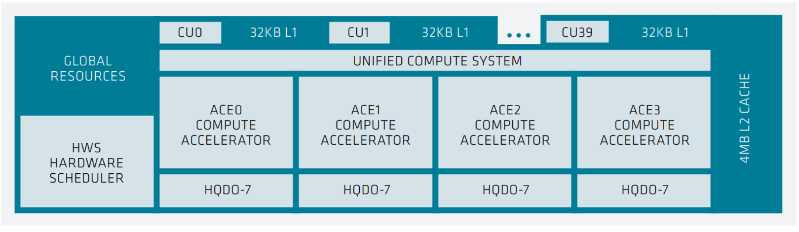
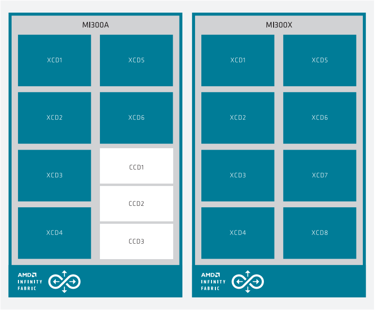
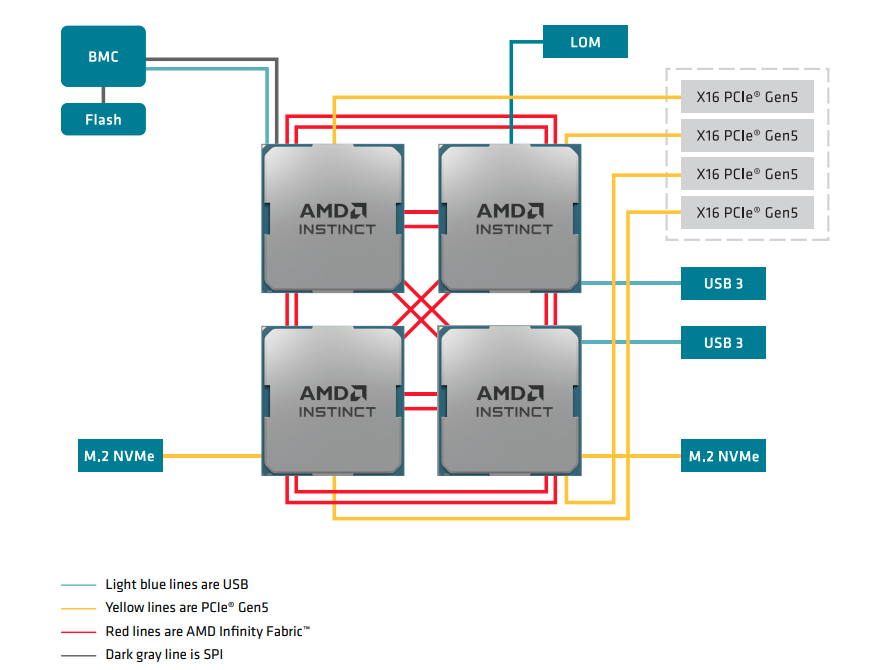
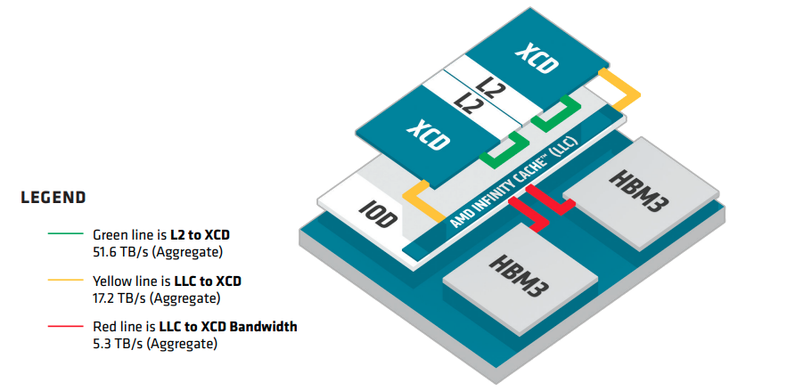

# Working with the MI300A System

## MI300A Architecture Details
This section describes the [MI300A architecture](https://rocm.docs.amd.com/en/latest/conceptual/gpu-arch/mi300.html) and the [Supermicro AS -4145GH-TNMR](https://www.supermicro.com/en/products/system/gpu/4u/as-4145gh-tnmr) configuration for Nicholson on the Galapagos cluster.

### CDNA3 Accelerator Complex Die (XCD)
The AMD Instinct MI300 series accelerators are based on the AMD CDNA 3 architecture, which introduced the Accelerator Complex Die (XCD), which contains the GPU computational elements of the processor along with the lower levels of the cache hierarchy.

<figure markdown="span">
  { width="600" }
  <figcaption>The structure of a single XCD in the AMD Instinct MI300 accelerator series.</figcaption>
</figure>

On the XCD, four Asynchronous Compute Engines (ACEs) send compute shader workgroups to the Compute Units (CUs). The XCD has 40 CUs: 38 active CUs at the aggregate level and 2 disabled CUs for yield management. The CUs all share a 4 MB L2 cache that serves to coalesce all memory traffic for the die. 

<figure markdown="span">
  { width="600" }
  <figcaption>MI300 series system architecture showing MI300A (left) with 6 XCDs and 3 CCDs, while the MI300X (right) has 8 XCDs.</figcaption>
</figure>

On Nicholson, the Galapagos cluster's MI300A system, 4x MI300A APUs are connected via AMD Infinity Fabric (XGMI) interfaces. In our latest setup, `rocm-bandwidth-test` reports up to 182 GB/s transfer rate between APUs.

<figure markdown="span">
  { width="600" }
  <figcaption>The 4xMI300A topology</figcaption>
</figure>

### AMD CDNA 3 Memory Hierarchy
The AMD CDNA 3 architecture introduces significant advancements in the memory hierarchy, particularly beyond the Compute Units (CUs), with a complete redesign to optimize performance across heterogeneous chiplets. This new memory architecture enhances cache coherency for co-packaged CPU chiplets in APU products and efficiently leverages the chiplet-based design to improve throughput and scalability.

At the core of this redesign is the shared L2 cache within each XCD (chiplet). The L2 is a 4MB, 16-way set associative cache, featuring 16 massively parallel channels, each 256KB in size. The L2 cache services requests from both lower-level instruction and data caches, ensuring efficient handling of memory traffic across the chiplet. On the read side, each channel can read a 128-byte cache line, with the L2 sustaining up to four concurrent requests from different CUs per cycle, resulting in a combined throughput of 2 KB per clock for each XCD.

On the write side, the L2 cache’s 16 channels each support a 64-byte half-line write per clock cycle, with one fill request from the Infinity Fabric™ per clock. This is a key difference from the previous AMD CDNA 2 architecture, where each L2 cache had 32 channels but fewer overall instances. In AMD CDNA 3, there are up to eight L2 cache instances, delivering an aggregate read bandwidth of up to 34.4 TB/s across the system.

The L2 cache is a writeback and write-allocate design, coalescing and reducing memory traffic that spills out to the AMD Infinity Cache™, minimizing unnecessary data transfers across the AMD Infinity Fabric™. The L2 cache is coherent within an XCD, while cache coherency across multiple XCDs is maintained by the Infinity Cache’s snoop filter, which efficiently resolves most inter-XCD coherent requests without disturbing the heavily utilized L2 caches.

These enhancements to the memory hierarchy improve data locality and reduce latency, enabling AMD CDNA 3 GPUs to achieve higher sustained performance in HPC workloads. Refer to Figure 6 for a visual representation of the memory architecture.

<figure markdown="span">
  { width="600" }
  <figcaption></figcaption>
</figure>

[**Read more about the MI300A architecture on the ROCm Documentation**](https://rocm.docs.amd.com/en/latest/conceptual/gpu-arch/mi300.html)

## Limiting the maximum and single memory allocations on the GPU
Many AI-related applications were originally developed on discrete GPUs. Some of these applications have fixed problem sizes associated with the targeted GPU size, and some attempt to determine the system memory limits by allocating chunks until failure. These techniques can cause issues in an APU with a shared space.

To allow these applications to run on the APU without further changes, ROCm supports a default memory policy that restricts the percentage of the GPU that can be allocated. The following environment variables control this feature:

* `GPU_MAX_ALLOC_PERCENT`
* `GPU_SINGLE_ALLOC_PERCENT`

These settings can be added to the default shell environment or the user environment. The effect of the memory allocation settings varies depending on the system, configuration, and task. They might require adjustment, especially when performing GPU benchmarks. Setting these values to 100 lets the GPU allocate any amount of free memory. However, the risk of encountering an operating system out-of-memory (OMM) condition increases when almost all the available memory is used.

Before setting either of these items to 100 percent, carefully consider the expected CPU workload allocation and the anticipated OS usage. For instance, if the OS requires 8GB on a 128GB system, setting these variables to 100 authorizes a single workload to allocate up to 120GB of memory. Unless the system has swap space configured any over-allocation attempts will be handled by the OMM policies.
[*Source*](https://rocm.docs.amd.com/en/latest/how-to/system-optimization/mi300a.html)

On the Galapagos cluster, the Slurm configuration uses [specialized resources](https://slurm.schedmd.com/core_spec.html#system) to reserve 8GB of memory for the host operating system. Additionally, we set the `GPU_MAX_ALLOC_PERCENT` and `GPU_SINGLE_ALLOC_PERCENT` to `75` (75%) as a default. 

!!! note
    We have not yet tested the impact of varying this setting under various workload conditions.

## Using MPI Bind
*Coming soon*