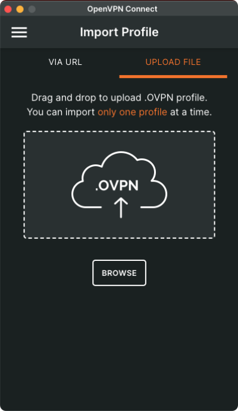
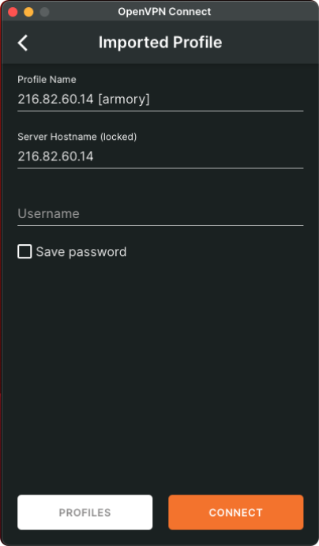
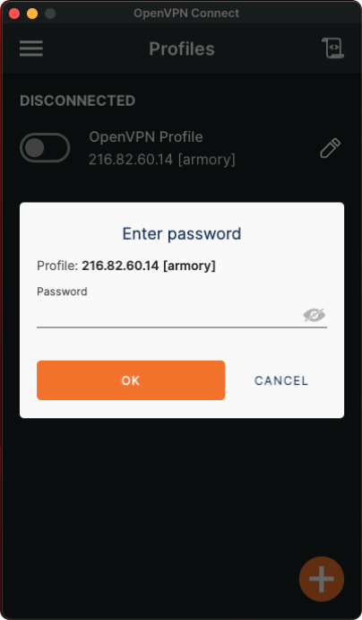

# Fluid Numerics VPN
The Fluid Numerics Galapagos systems are only accessible through Fluid Numerics Virtual Private Network (VPN). This documentation will walk you through how to get started with OpenVPN3 on Linux operating systems. Before proceeding any further, you will need to have VPN credentials created for you. 

Reach out to [Fluid Numerics Support](../contact-us.md) if you do not have OpenVPN credentials.


## Installation
You will need to install OpenVPN3 on your local workstation or laptop. For this, you will need administrator privileges on your workstation or laptop. Follow one of the guides below from OpenVPN to install OpenVPN3 (or OpenVPN Client) on your workstation.

* [Linux](https://openvpn.net/cloud-docs/owner/connectors/connector-user-guides/openvpn-3-client-for-linux.html)
* [Install OpenVPN Client on Mac OS](https://openvpn.net/vpn-server-resources/installation-guide-for-openvpn-connect-client-on-macos/)


## Using OpenVPN3 on Linux


!!! warning

    Before proceeding, be sure that you have [installed the OpenVPN3 CLI on Linux](https://openvpn.net/cloud-docs/owner/connectors/connector-user-guides/openvpn-3-client-for-linux.html)

!!! note

    When your Fluid Numerics VPN credentials are created, you will also receive an `galapagos.ovpn` OpenVPN configuration file. We recommend that you save this file to `$HOME/.openvpn/galapagos.ovpn`

Once you have received the `galapagos.ovpn` configuration file in addition to credetials for the `galapagos.fluidnumerics.cloud` VPN, you can manage your connection to Fluid Numerics' VPN from a terminal using the `openvpn3` command line interface.

### Connect
To connect to the `galapagos.fluidnumerics.cloud` VPN, use `openvpn3 session-start` command in a terminal and provide the `galapagos.ovpn` configuration file to the `--config` flag

```
openvpn3 session-start --config ${HOME}/.openvpn/client1.ovpn
```

At the prompt, enter your username and password provided for the VPN service. Note that this is **not your Google Workspace credentials**.

To view the VPN connections you have active,
```
$ openvpn3 sessions-list
-----------------------------------------------------------------------------
        Path: /net/openvpn/v3/sessions/15289a1as7f83s411asa4f8s31e5869ee21f
     Created: Tue Jan 16 16:27:08 2024                  PID: 6402
       Owner: joe                                    Device: tun0
 Config name: /home/joe/.openvpn/client1.ovpn  (Config not available)
Session name: xxx.xxx.xxx.xxx
      Status: Connection, Client connected
-----------------------------------------------------------------------------
```

### Disconnect
To disconnect from the `galapagos.fluidnumerics.cloud`, you can use `openvpn3 manage-session --disconnect`. This command requires the `--path` argument, which specifies the path to the session in the OpenVPN3 session manager. Assuming you have no other VPN connections active, you can obtain the session path with `openvpn3 sessions-list` and `grep`'ing for the `Path` output. The command below neatly summarizes how to disconnect from the most recent VPN connection started with OpenVPN3.

```
openvpn3 session-manage --disconnect --path $(openvpn3 sessions-list | grep Path | head -n1 | awk -F ":" '{print $2}')
```


## Using OpenVPN Client on Mac OS

!!! warning

    Before proceeding, be sure that you have [installed the OpenVPN Client on Mac OS](https://openvpn.net/vpn-server-resources/installation-guide-for-openvpn-connect-client-on-macos/)

!!! note

    When your Fluid Numerics VPN credentials are created, you will also receive an `galapagos.ovpn` OpenVPN configuration file. We recommend that you save this file to `$HOME/openvpn/galapagos.ovpn`

Once you have received the `galapagos.ovpn` configuration file in addition to credetials for the `galapagos.fluidnumerics.cloud` VPN, you can manage your connection to Fluid Numerics' VPN from a terminal using the `openvpn3` command line interface.

### Connect
To connect to the Fluid Numerics Galapagos VPN, open the OpenVPN Client application. When you connect for the first time, you will select the "Upload File" tab and select "Browse" to upload the provided `galapagos.ovpn` configuration profile.

{ align=center }

Once you have selected the `galapagos.ovpn` configuration file, you will be prompted for your VPN user name. Type in your username and click "Connect".

{ align=center }

You will then be prompted for your VPN password. **Note that this is different from your Google Workspace (fluidnumerics.com) password.** Enter your password and then click ok.

{ align=center }

To verify that the connection is successful, open a terminal and run

```
ping -c 1 port.galapagos.fluidnumerics.cloud
```

You should receive a response from the login node of our cluster.


## Logging in to the galapagos
Once you have connected to the `galapagos.fluidnumerics.cloud` VPN, you can access the galapagos systems using an `ssh` client from your terminal

```
ssh username@port.galapagos.fluidnumerics.cloud
```

For ssh, your username is your Google Workspace username (without `@fluidnumerics.com`) and your password is your Google Workspace password associated with your fluidnumerics.cloud account.
